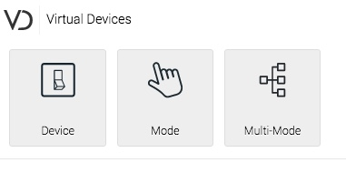
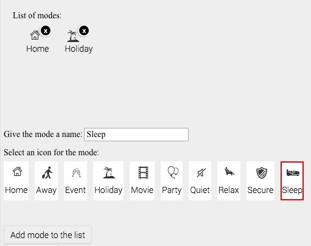
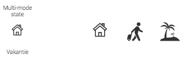

# Virtual Devices

* [Description](index)
* [Define a Multimode device](multimode)
* [Setting a sensor](sensor)
* [Versions](version)

## Multi-Mode
A multi-mode is a device that can be set in more than 2 possible values in stead of 'on' or 'off'.

### How to add a Multi-Mode Device

1. Under Virtual Devices, choose Multi-Mode 
2. Similar to Virtual Devices you can give it a name and select an icon.
3. Set a mode name, select an icon an press 'Add mode to the list'
4. Repeat Step 3. for each mode that you want to add. 
5. When the list of modes is complete press the 'Add Device' button (same as for a normal Virtual Device).

### Setting the mode of a Virtual Device

When setting a Multi-Mode device, just press one of the icons to reflect the current mode. 

Note that the device-icon remain the same and does **not** reflect the mode. However, the label below the icon **does** show the mode.

### Using the Multi-mode in a flow

TBD, but in short: use the mode name in the and- and Then-column.
