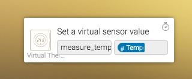
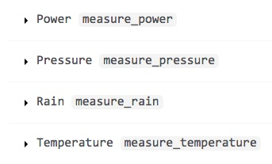

# Virtual Devices

* [Description](index)
* [Define a Multimode device](multimode)
* [Setting a sensor](sensor)
* [Versions](version)

## sensor

A Virtual Sensor is a bit contradictory, but nevertheless users wanted to view a value in a device, e.g. the actual room temperature in a Thermostat.

### How to add a Sensor

Simply add one of the sensor-capabilities to a Virtual Device.

### How to set the sensor's value

The value of a sensor can be set with an action-card in a flow.

1. Add the card entitled 'Set a virtual sensor value' in the Then-column of a flow.
2. Set the technical name (see below) of the sensor-capability in the first field.
3. Set the value in the second field. This can also be a tag from another device or card.

### What are the technical names of the sensor capabilities

The technical name to fill in step 2 above is the capability name as shown on
[Athom's capability reference](https://developer.athom.com/docs/apps/tutorial-Drivers-Reference.html).

It is the name in the grey-box, e.g. measure_temperature.

Currently only measure_temperature and measure_power are supported.
